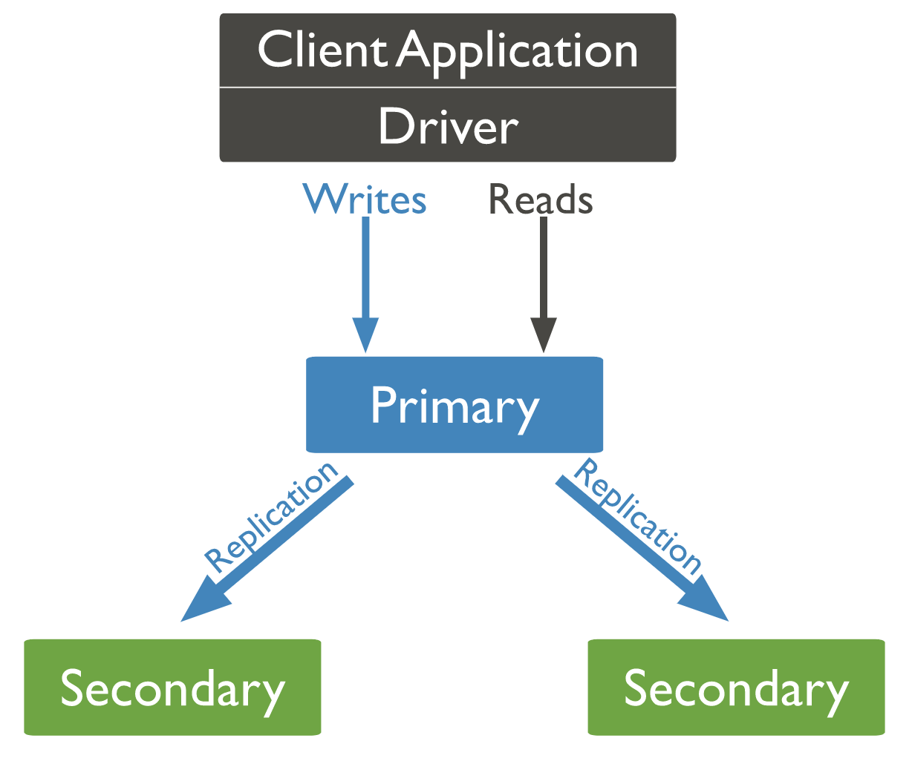
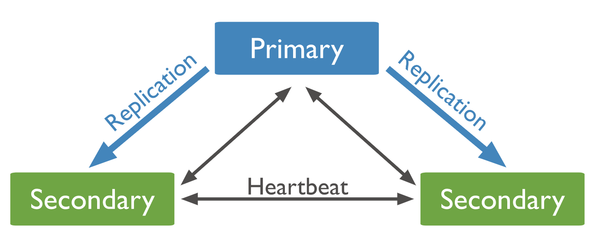

# MongoDB副本

在MongoDB中副本集（replica set）是一组mongod进程的集合，这组集合维护同一套数据。副本集比起单一数据库服务器来说极大的降低了数据丢失风险。

副本集的好处在于提高客户端的读写能力，对于分布式应用而言，维护多套数据中心有助于数据的落地和使用。我们同时还可以利用副本数据中心做很多额外的工作，诸如：disaster recovery灾备恢复，数据报告，备份。

一般情况下，副本集包含了若干个数据节点和一个可选的仲裁节点。在数据节点中会有一个主节点primary node, 剩下的则称为二级节点。主节点负责与客户端进行交互，其日志会放在olog中

对于二级节点而言，它们会记录主节点的与客户端的交互日志olog,以及备份数据集，一旦主节点挂掉，它们会选举出一个新的主节点。

除了上述这种架构之外，工程师还可以添加一个mongod实例化作为arbiter, Arbiter并不维护数据集合。它的工作只是通过响应heartbeat和其他副本的选举请求来确认节点数量。

You may add an extra mongod instance to a replica set as an arbiter. Arbiters do not maintain a data set. The purpose of an arbiter is to maintain a quorum in a replica set by responding to heartbeat and election requests by other replica set members. Because they do not store a data set, arbiters can be a good way to provide replica set quorum functionality with a cheaper resource cost than a fully functional replica set member with a data set. If your replica set has an even number of members, add an arbiter to obtain a majority of votes in an election for primary. Arbiters do not require dedicated hardware. For more information on arbiters, see Replica Set Arbiter.